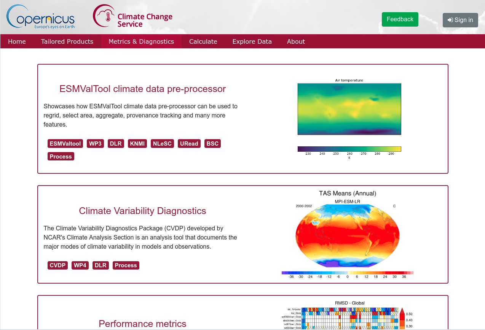

.. C3S Magic documentation master file, created by
   sphinx-quickstart on Tue Feb 26 11:08:08 2019.
   You can adapt this file completely to your liking, but it should at least
   contain the root `toctree` directive.

C3S Magic Portal
================

The Metrics and Access to Global Indices for Climate Projections (MAGIC) portal provides a quick and easy assessment of climate projections using well-established performance metrics. It allows the user to configure these criteria, apply them on selected CMIP5 model output and visualize results in the browser or download them onto your local machine.

    Screenshot of the MAGIC Portal

The MAGIC portal provides both metrics on model fidelity, targeted to climate scientists and meteorologists, as well as tailored products for different economic sectors, including insurances, agriculture, water management and sustainable energy.

Technically, the MAGIC portal consists of a number of services, which together form the portal site. Most of these services can also function standalone, many are based on existing community software.

This documentation serves as an installation guide, overview of all services, and user guide.

.. toctree::
   :maxdepth: 1
   :caption: Contents:

   installation
   user_guide

Indices and tables
==================

* :ref:`genindex`
* :ref:`search`
