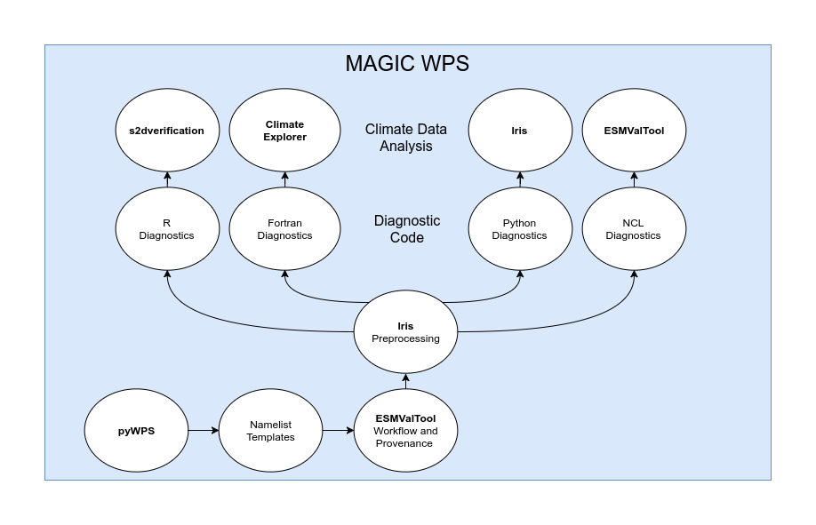
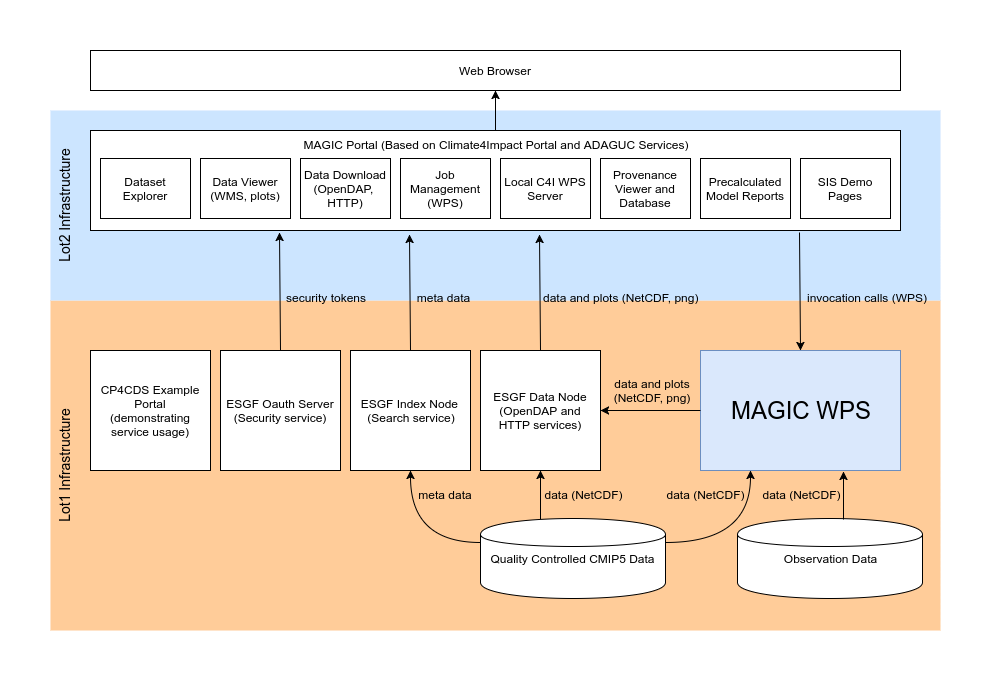

System Overview
===============

The MAGIC Web Processing Service (WPS) provides the scientific functionality of MAGIC. Building on s2dverificatoin, climate explorer, iris, ESMValTool, pyWPS, and other libraries and tools, the WPS takes ESGF CMIP5 data and processes these into the graphs and data shown on this portal.

This is an overview of the infrastructure in which the WPS is running. It consists of the portal system based on Climate4Impact and ADAGUC Services. These run on cloud infrastructure outside of ESGS, and is managed by the MAGIC team.

The actual processing of ESGF data will be done on infrastructure provided by the CP4CD project.
